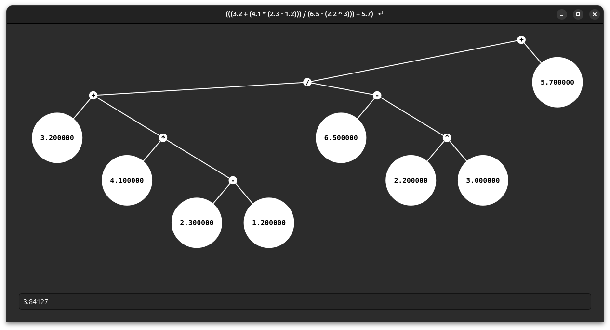

# Expressions

Simple graphical calculator with a twist: it displays the binary tree used to evaluate the expressions



It is only a small coding challenge and should only be viewed as such.


## Try it out
You will have to clone this repository and build from source.

```bash
git clone url
```

In the newly created directory use the build and install script provided. As you should NEVER run a random script without first checking it, here it is in it's entierty:
```bash
echo "install gtkmm-4.0 using apt"
sudo apt install libgtkmm-4.0-dev

echo "install meson project"
meson builddir

echo "compile project"
ninja -Cbuilddir

echo "install for local user"
cp builddir/src/expressions ~/.local/bin/

echo "cleaning up"
rm -r builddir
```

As you can see, the executable is copied to your .local/bin directory, so you can use it as a command.

## Usage
Simply launch with 
```bash
expressions
```

You may want to see all the debug logs, then use
```bash
expressions --debug true
```